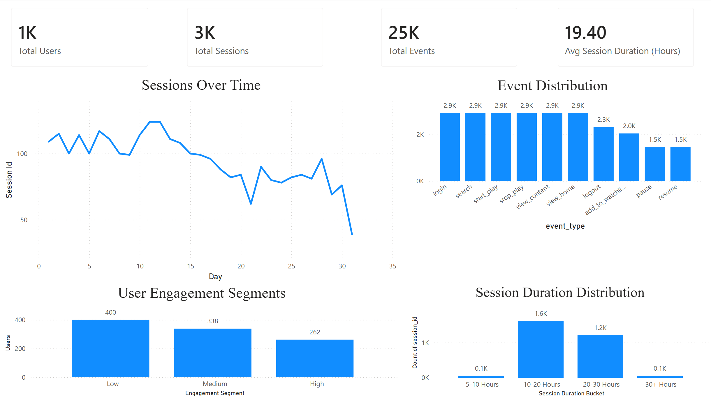
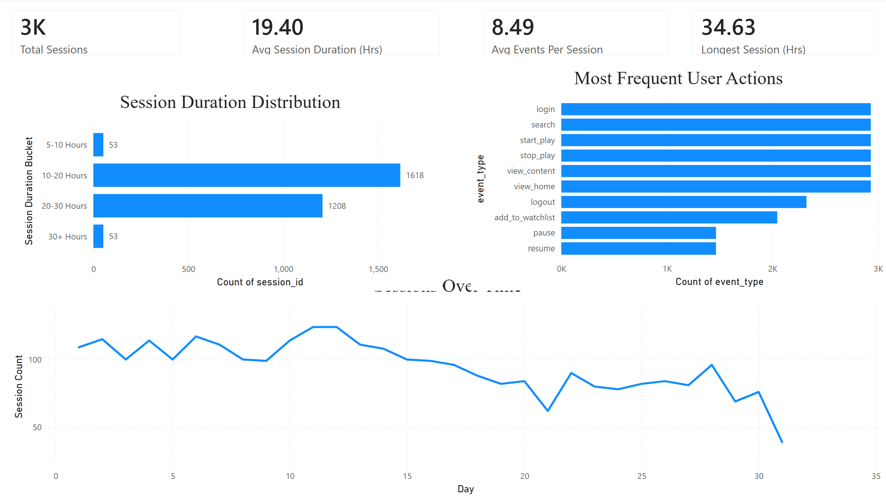
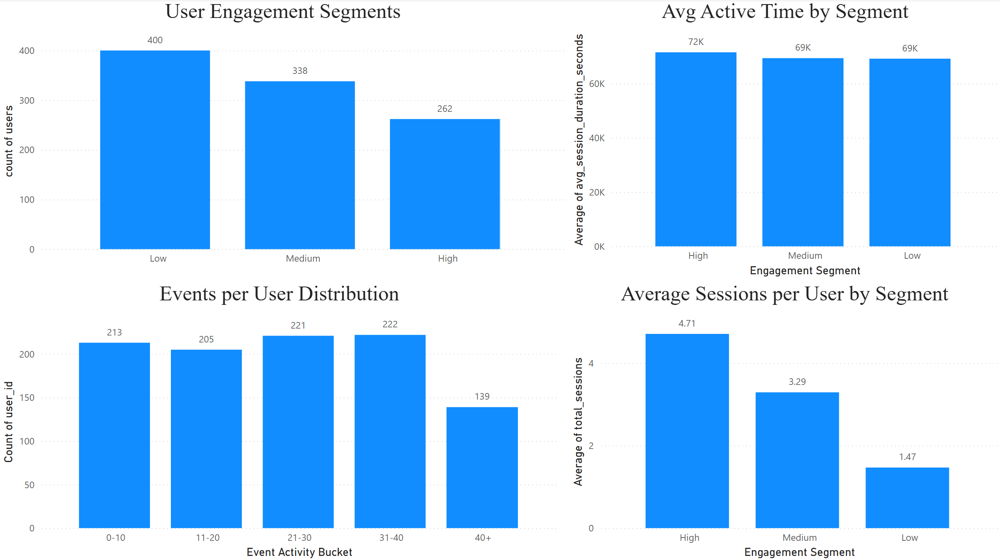

# 📊 Product Analytics Pipeline

An end-to-end product analytics project simulating a streaming/content platform. Covers the full data stack: synthetic event generation in Python, ELT transformation with dbt (PostgreSQL), and business intelligence dashboards in Power BI.

---

## 🎯 Business Objective

A streaming platform wants to understand:

- How users engage with content
- Which actions drive session activity
- Where users drop off in the product funnel
- How retention changes over time
- Which user segments generate the most engagement

This project builds a modern analytics pipeline to answer these questions using PostgreSQL, dbt, and Power BI.

## 🗂️ Project Structure

```
product-analytics/
├── python/
│   └── generate_events.py        # Synthetic event data generator
├── data/
│   └── raw/
│       └── user_events.csv       # Generated raw event data (1K users, ~25K events)
├── product_analytics_dbt/
│   ├── models/
│   │   ├── staging/              # Cleans and casts raw source data
│   │   ├── marts/
│   │   │   ├── dimensions/       # dim_users, dim_events
│   │   │   ├── core/             # fct_user_sessions, fct_user_analytics
│   │   │   ├── analytics/        # fct_user_funnel, fct_funnel_conversion, fct_user_cohort_retention
│   │   │   └── bi/               # fct_product_overview (executive summary model)
│   │   └── schema.yml            # dbt tests and model documentation
│   └── dbt_project.yml
├── dashboards/
│   ├── Product_Analytics.pbix    # Power BI workbook
│   ├── Executive_Overview.png
│   ├── session_analytics.png
│   └── User_analytics&segmentation.png
└── README.md
```

---

## 🏗️ Architecture Overview

This project follows the **medallion-style dbt layering pattern**:

```
raw.raw_events  (PostgreSQL source table)
      │
      ▼
 stg_events     (staging: clean, cast, rename)
      │
      ├──▶  dim_users              (one row per user, first/last seen)
      ├──▶  dim_events             (event type lookup + funnel order)
      ├──▶  fct_user_sessions      (one row per session, duration + event count)
      │           │
      │           ▼
      │     fct_user_analytics     (one row per user, lifetime metrics)
      │           │
      │           ▼
      │     fct_product_overview   (single-row executive KPI summary)
      │
      ├──▶  fct_user_funnel        (one row per user, funnel step flags)
      ├──▶  fct_funnel_conversion  (aggregate funnel with step-by-step conversion %)
      └──▶  fct_user_cohort_retention  (weekly cohort × retention rate)
```

---

## 📐 Data Models

### Staging
| Model | Description | Grain |
|---|---|---|
| `stg_events` | Cleaned raw events — casts timestamp, selects needed columns | One row per event |

### Dimensions
| Model | Description | Grain |
|---|---|---|
| `dim_users` | User attributes: first seen, last seen, total events | One row per `user_id` |
| `dim_events` | Event type reference with funnel order (1–10) | One row per `event_type` |

### Core Facts
| Model | Description | Grain |
|---|---|---|
| `fct_user_sessions` | Session metrics: start/end time, event count, duration (seconds) | One row per `session_id` |
| `fct_user_analytics` | Lifetime user metrics: total sessions, avg session duration, first/last active | One row per `user_id` |
| `fct_product_overview` | Executive KPIs: total users, total sessions, avg session duration | Single row |

### Analytics Facts
| Model | Description | Grain |
|---|---|---|
| `fct_user_funnel` | Whether each user completed each funnel step (binary flags) | One row per `user_id` |
| `fct_funnel_conversion` | Step-by-step funnel conversion rates across all users | Single row |
| `fct_user_cohort_retention` | Weekly cohort retention — % of cohort active in each subsequent week | One row per `cohort_week × activity_week` |

---

## 🧪 Data Quality Tests

dbt tests are defined in `schema.yml` and run automatically with `dbt test`:

| Model | Column | Tests |
|---|---|---|
| `stg_events` | `user_id`, `session_id`, `event_type`, `event_time` | `not_null` |
| `dim_users` | `user_id` | `not_null`, `unique` |
| `dim_events` | `event_type` | `not_null`, `unique` |
| `fct_user_sessions` | `session_id` | `not_null`, `unique` |
| `fct_user_sessions` | `user_id` | `not_null`, `relationships` → `dim_users` |
| `fct_user_analytics` | `user_id` | `not_null`, `unique`, `relationships` → `dim_users` |

---

## 📊 Lineage Graph (DBT)


## 📊 Dashboards (Power BI)

Three dashboard pages built on top of the dbt models:

**Executive Overview** — Top-level KPIs (total users, sessions, events, avg session duration), sessions over time, event distribution, user engagement segments, and session duration distribution.

**Session Analytics** — Session duration buckets, most frequent user actions, and sessions over time trend.

**User Analytics & Segmentation** — Users broken into Low / Medium / High engagement segments, events per user distribution, avg active time by segment, and avg sessions per user by segment.





---

## 🛠️ Tech Stack

| Layer | Tool |
|---|---|
| Data Generation | Python (pandas, Faker) |
| Data Warehouse | PostgreSQL |
| Transformation | dbt Core |
| BI / Visualization | Power BI |
| Version Control | Git |

---

## 🚀 Getting Started

### 1. Generate the raw data

```bash
cd python
pip install pandas faker
python generate_events.py
# Output: data/raw/user_events.csv
```

### 2. Load raw data into PostgreSQL

Load `data/raw/user_events.csv` into a table called `raw_events` in the `public` schema of your PostgreSQL database.

```sql
CREATE TABLE public.raw_events (
    user_id      INTEGER,
    session_id   TEXT,
    event_type   TEXT,
    content_id   INTEGER,
    timestamp    TEXT
);

-- Then load via psql \copy or your preferred method
\copy public.raw_events FROM 'data/raw/user_events.csv' CSV HEADER;
```

### 3. Configure dbt profile

Add a profile to `~/.dbt/profiles.yml`:

```yaml
product_analytics_dbt:
  target: dev
  outputs:
    dev:
      type: postgres
      host: localhost
      user: *******
      password: ******
      port: 5432
      dbname: your_database
      schema: public
      threads: 4
```

### 4. Run the dbt pipeline

```bash
cd product_analytics_dbt

dbt deps          # install dependencies (if any)
dbt run           # build all models
dbt test          # run data quality tests
dbt docs generate # generate documentation site
dbt docs serve    # open docs in browser
```

### 5. Open the dashboard

Open `dashboards/Product_Analytics.pbix` in Power BI Desktop and update the data source connection to point to your PostgreSQL instance.

---

## 🔍 Key Insights

- Generated analytics for 1,000 users across 25,000+ events and 3,000 sessions
- Average user completed 8.49 events per session
- Most sessions lasted between 10–20 hours (synthetic data)
- High-engagement users averaged 4.71 sessions compared to 1.47 for low-engagement users
- Search, content viewing, and playback events accounted for the majority of user interactions

## 📈 Key Metrics Produced

- **Funnel conversion rates** — step-by-step drop-off from login → view → search → play
- **Weekly cohort retention** — how many users return in weeks 1, 2, 3+ after first activity
- **User engagement segmentation** — Low / Medium / High segments based on session count
- **Session-level metrics** — duration, event count, start/end timestamps
- **Executive KPIs** — single-row summary table ready for BI consumption

---

## 📁 Data Model

The source dataset simulates a streaming platform with 1,000 users generating ~25,000 events across ~3,000 sessions. Each event belongs to a session and follows a realistic user journey:

```
login → view_home → search → view_content → start_play
     → [pause → resume]   (50% of sessions)
     → stop_play
     → [add_to_watchlist]  (70% of sessions)
     → [logout]            (80% of sessions)
```

**Event types:** `login`, `view_home`, `search`, `view_content`, `start_play`, `pause`, `resume`, `stop_play`, `add_to_watchlist`, `logout`